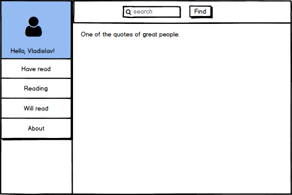
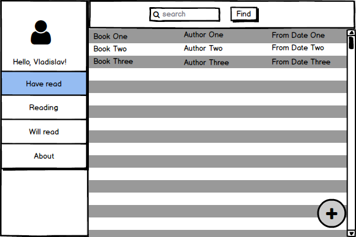
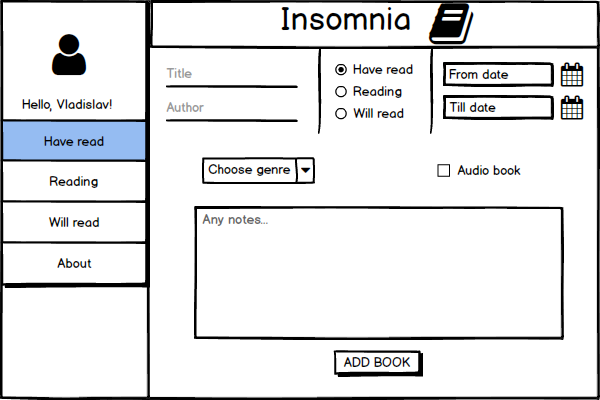
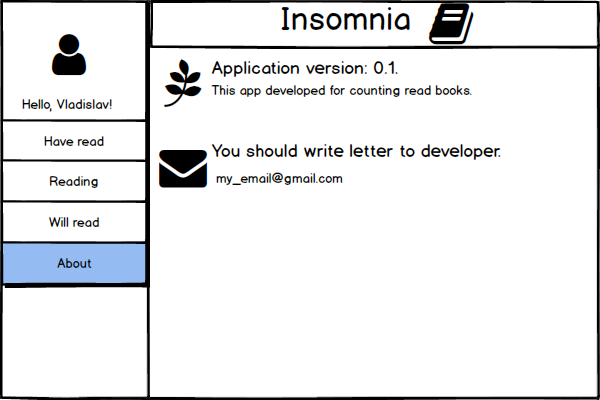

# Требования к проекту

# Содержание
1. [Введение](#1)  
  1.1 [Назначение](#1.1)  
  1.2 [Бизнес-требования](#1.2)  
    1.2.1 [Исходные данные](#1.2.1)  
    1.2.2 [Бизнес возможности](#1.2.2)  
  1.3 [Аналоги](#1.3)  
2. [Требования пользователя](#2)  
  2.1. [Программные интерфейсы](#2.1)  
  2.2. [Интерфейс пользователя](#2.2)  
  2.3. [Характеристики пользователей](#2.3)  
    2.3.1 [Классы пользователей](#2.3.1)  
    2.3.2 [Аудитория приложения](#2.3.2)  
        2.3.2.1. [Целевая аудитория](#2.3.2.1)  
  2.4. [Предположения и зависимости](#2.4)  
3. [Системные требования](#3)  
  3.1 [Функциональные требования](#3.1)  
    3.1.1 [Основные функции](#3.1.1)  
        3.1.1.1 [Вход пользователя в приложение](#3.1.1.1)  
        3.1.1.2 [Добавление книги в список](#3.1.1.2)  
        3.1.1.3 [Просмотр списков](#3.1.1.3)  
        3.1.1.4 [Просмотр информации о книге](#3.1.1.4)  
        3.1.1.5 [Редактирование информации о книге](#3.1.1.5)  
        3.1.1.6 [Удаление книги](#3.1.1.6)  
        3.1.1.7 [Выход зарегистрированного пользователя из учётной записи](#3.1.1.7)  
     3.1.2 [Ограничения и исключения](#3.1.2)  
  3.2 [Нефункциональные требования](#3.2)  
     3.2.1 [Атрибуты качества](#3.2.1)  
        3.2.1.1 [Надежность](#3.2.1.1)  

# 1 Введение 

## 1.1 Назначение 

 В этом документе описаны функциональные и нефункциональные требования к настолькому приложению «Insomnia». Этот документ предназначен для команды, которая будет реализовывать и проверять корректность работы приложения.

## 1.2 Бизнес-требования 

### 1.2.1 Исходные данные 

Согласно сайту d-russia.ru на 2017 год около 60% людей из 17 самых читаемых стран мира как минимум раз в неделю читают книги. Это значит, что чтение в наши дни еще достаточно популярно, и есть истинные ценители и любители этого занятия. Именно для таких людей разрабатывают приложения для учета книг как прочитанных, так и тех, которые хотят прочитать.
Однако, не все из них имеют простой интерфейс. Это приводит к тому, что люди отказываются использовать такие приложения. 

### 1.2.2 Возможности бизнеса 

Многие люди желают иметь приложение, которое позволит хранить список прочитанных, читаемых в данный момент и желаемых прочитать книг, с простым интерфейсом. Подобное приложение позволит им тратить меньше времени на занесение книги в список, а также просмотр списка книг и информации о книгах. 

## 1.3 Аналоги 

Данное приложение является альтернативным вариантом андроидного приложения ["Books I've read"](https://play.google.com/store/apps/details?id=rrr.renatko.books.app) и предназначено для использования на компьютере.
 
# 2 Требования пользователя 

## 2.1 Программные интерфейсы  

- Должна быть возможность добавления книги в один из списков (прочитанные книги, читаемые в данный момент, желаемые книги).
- Должна быть возможность просмотра списков книг.
- Должна быть возможность просмотра информации о выбранной книге. 
 
## 2.2 Интерфейс пользователя

- Главный экран приложения

  
- Страница со списком книг

  
- Страница для добавления книги

  
- Страница с информацией о приложении

  

## 2.3 Характеристики пользователей  

### 2.3.1 Классы пользователей 

| Класс пользователей | Описание |
|:---|:---|
| Незарегистрированные пользователи |  Не имеют доступ к функционалу |
| Зарегистрированные пользователи | Пользователи, которые вошли в приложение под своим псевдонимом, желающие хранить свои списки книг. Имеют доступ к всему функционалу |

### 2.3.2 Аудитория приложения 

#### 2.3.2.1 Целевая аудитория 
 Люди, которые любят читать и читают книги разных жанров, а также обладают компьютером.

## 2.4 Предположения и зависимости 
1. Приложение будет работать независимо от подключения к Интернету.

# 3 Системные требования 

## 3.1 Функциональные требования 

### 3.1.1 Основные функции 

#### 3.1.1.1 Вход пользователя в приложение 
**Описание.** Пользователь не имеет возможность использовать приложение без создания своего аккаунта и не войдя в свою учетную запись.

| Функция | Требования | 
|:---|:---|
|Регистрация нового пользователя | Приложение должно запросить у пользователя ввести имя, логин и пароль для создания учётной записи. Пользователь должен ввести имя, логин, пароль и нажать "Sign up" |
| *Пользователь с таким именем существует* | *Приложение должно сообщить об ошибке создания учетной записи и попросить ввести другие данные*

#### 3.1.1.2 Добавление книги в список  
**Описание.** Пользователь должен иметь возможность добавления книги в один из списков: прочитанные, читаемые в данный момент или желаемые прочитать книги.

| Функция | Требования | 
|:---|:---|
|Добавление книги | Пользователь может добавлять книги в списки, после чего книги должны заносится в эти списки |
|Ввод информации о книге|Пользователь должен ввести название книги, автора, дату начала и конца чтения, жанр и пометить, если данная книга является аудиокнигой, а также возможно введение своих пометок или комментариев к книге|

#### 3.1.1.3 Просмотр списков 
**Описание.** Пользователь должен имеет возможность просматривать списки книг.

| Функция | Требования | 
|:---|:---|
| Просмотр списков | Пользователь имеет возможность просмотреть списки прочитанных, читаемых в данный момент и желаемых прочитать книги; в списках отображается название каждой книги, автор, дата начала чтения книги |

#### 3.1.1.4 Просмотр информации о книге 
**Описание.** Пользователь имеет возможность просмотреть информацию о книге.

| Функция | Требования | 
|:---|:---|
| Просмотр информации о книге | Пользователь должен иметь возможность просмотреть информацию о книге, которую он вводил|

#### 3.1.1.5 Редактирование информации о книге 
**Описание.** Пользователь имеет возможность редактировать введенную ранее информацию о книге.

| Функция | Требования | 
|:---|:---|
| Редактирование введенной информации| Пользователь должен иметь возможность изменить информацию о книге, которую он вводил|

#### 3.1.1.6 Удаление книги 
**Описание.** Пользователь имеет возможность удалить книгу из списков.

| Функция | Требования | 
|:---|:---|
| Удаление книги|Приложение должно предоставить возможность пользователю безвозвратно удалить книгу из списков|

#### 3.1.1.7 Выход зарегистрированного пользователя из учётной записи 
**Описание.** Зарегистрированный пользователь имеет возможность выйти из учётной записи.

**Требование.** Приложение должно предоставить пользователю возможность выйти из учетной записи и возвратить пользователя к окну входа в учетную запись.

### 3.1.2 Ограничения и исключения 
1. Приложение работает независимо от подключения к Интернету.

## 3.2 Нефункциональные требования 

### 3.2.1 Атрибуты качества 

#### 3.2.1.1 Надежность 
Если соединение между пользователем и приложением разрывается до того, как книга добавлена или добавление отменено, приложение Insomnia должно позволять пользователю восстановить незавершонное добавление книги.
